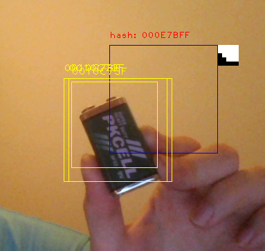

###Детектор объектов на основе перцептивного хэша

- [Статья на хабре](https://habr.com/post/344194/)

### Как работает детектор объектов?
Данный детектор использует [перцептивный хэш](https://habr.com/post/120562/), который очень легко рассчитывается из интегрального изображения. Алгоритм ищет перцептивные хэши по всему изображению, сопоставляя их с заранее известным разрешенным списком перцептивных хэшей искомого объекта. Если некоторый участок изображения отличается от одного из искомого перцептивного хэша не более чем на заданное расстояние Хэмминга, то алгоритм запоминает ограничительную рамку данной области изображения.

### Для чего можно использовать данный алгоритм?
Данный детектор является слабым алгоритмом поиска объектов и его можно применять для предварительной фильтрации областей возможного нахождения искомого объекта. После того, как возможные области были обнаружены, можно применить другой алгоритм и отсеить ложные срабатывания. Детектор способен искать сразу несколько объектов.

### Пример работы детектора:

:tv:[видео](https://www.youtube.com/watch?v=9PaVvdPjDBk)

### Управление программой
- Чтобы добавить перцептивный хэш к списку для поиска (обучить программу), нажмите T
- Чтобы запустить или остановить детектор объектов, нажите R
- Чтобы стереть все цели, нажите C
- Чтобы выбрать номер объекта, нажите 1, 2 или 3. Это позволяет использовать мультиобъектный поиск
- Чтобы выйти из программы, нажмите B

### Используемые библиотеки
* *OpenCV 3.2*
